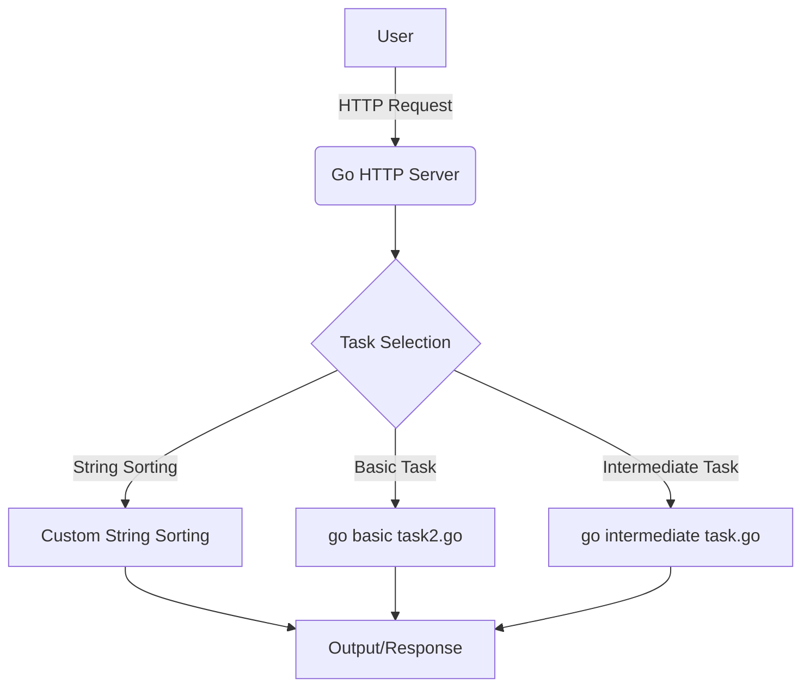

# <span align="center">🚀 **Project Title: Go Basic Tasks**</span>


---

## 📖 **Project Description**

**Go Basic Tasks** is an open-source project that brings together solutions to a variety of Go programming challenges, suitable for both beginners and experienced developers. The main purpose of this project is to showcase the fundamental and intermediate features of the Go language through practical, real-world examples, making it easier to learn, practice, and master Go with clear code samples.

---

## 🗂️ **Table of Contents**

- [Features](#features)
- [Installation](#installation)
- [Usage](#usage)
- [Screenshots / Demo](#screenshots--demo)
- [Architecture / Diagram](#architecture--diagram)
- [Technologies Used](#technologies-used)
- [API Reference](#api-reference)
- [Contributing Guidelines](#contributing-guidelines)
- [License](#license)
- [Authors / Maintainers](#authors--maintainers)
- [Acknowledgements](#acknowledgements)
- [FAQ](#faq)
- [Badges / Shields](#badges--shields)
- [Support / Contact](#support--contact)
- [Roadmap](#roadmap)
- [Known Issues](#known-issues)
- [Thank You](#thank-you)

---

## ✨ **Features**

- Solutions to basic and intermediate Go programming tasks
- Custom string sorting (user-defined string ordering)
- HTTP server example and request handling
- Modular and readable code structure
- Easily extensible project architecture
- Well-documented code samples

---

## 🛠️ **Installation**

### **Prerequisites**
- Go 1.20 or newer
- Git

### **MacOS / Linux**
```bash
git clone https://github.com/ilkinrzayeev/go-basic-tasks.git
cd go-basic-tasks
go mod tidy
go run main.go
```

### **Windows**
```powershell
git clone https://github.com/ilkinrzayeev/go-basic-tasks.git
cd go-basic-tasks
go mod tidy
go run main.go
```

### **Running Tests**
```bash
go test ./...
```

### **Linting**
```bash
golint ./...
```

---

## 🚀 **Usage**

Below are some basic usage examples:

#### **Custom String Sorting**
```bash
go run "Custom String Sorting.go"
```

#### **Running the HTTP Server**
```bash
go run "Go: HTTP Server.go"
```
Once the server is running, open your browser and navigate to `http://localhost:8080`.

#### **Other Tasks**
```bash
go run "go basic task2.go"
go run "go intermediate task.go"
```

---

## 🖼️ **Screenshots / Demo**

> **Custom String Sorting:**
>
> 
>
> **HTTP Server:**
>
> 

---

## 🏗️ **Architecture / Diagram**



**Diagram Explanation:**  
The user either sends an HTTP request or runs the program directly. The HTTP server or the main file processes the user's selection, executes the relevant task (string sorting, basic, or intermediate), and returns the result to the user.

---

## 🧰 **Technologies Used**

- [Go](https://golang.org/) — main programming language
- [Go Modules](https://blog.golang.org/using-go-modules) — dependency management
- [Mermaid](https://mermaid-js.github.io/) — for diagrams
- [Git](https://git-scm.com/) — version control

---

## 📚 **API Reference**

> **GET /**  
> Returns the main page and project status.

> **POST /sort**  
> Used for custom string sorting.  
> **Request Body:**
> ```json
> { "strings": ["apple", "pear", "banana"] }
> ```
> **Response:**
> ```json
> { "sorted": ["apple", "banana", "pear"] }
> ```

---

## 🤝 **Contributing Guidelines**

- Fork the repository and create a new branch (`feature/your-feature`)
- Follow code standards (Go fmt, lint)
- Run all tests before submitting a pull request
- Write clear and descriptive commit messages
- Add a description to your pull requests

---

## 📝 **License**

[](LICENSE)

This project is licensed under the MIT License. You are free to use, modify, and distribute it for any purpose, provided that the copyright and license notice are preserved.

---

## 👤 **Authors / Maintainers**

- **Ilkin Rzayev**  
  [GitHub](https://github.com/ilkinrzayeev)  
  [LinkedIn](https://linkedin.com/in/ilkinrzayev)  
  Email: ilkinrzayev@gmail.com

---

## 🙏 **Acknowledgements**

- Official Go documentation and tutorials
- Stack Overflow community
- Open source tools and libraries

---

## ❓ **FAQ**

**Q:** How can I extend the project?  
**A:** To add a new task, create a new `.go` file and integrate it with `main.go`.

**Q:** What Go version is required?  
**A:** Go 1.20 or newer.

---

## 🏅 **Badges / Shields**


---

## 💬 **Support / Contact**

If you have any questions or issues, [open an issue](https://github.com/ilkinrzayeev/go-basic-tasks/issues) or email directly: ilkinrzayev@gmail.com

---

## 🛣️ **Roadmap**

- [ ] Add new tasks
- [ ] Expand API endpoints
- [ ] Add a web interface
- [ ] Increase automated test coverage

---

## 🐞 **Known Issues**

- Some edge cases in tasks may not be fully covered
- The HTTP server is designed for local use and is not optimized for production environments

---

## 🙌 **Thank You**

Thank you for your interest in this project! Your contributions and feedback are highly appreciated and help drive the project forward.

---
