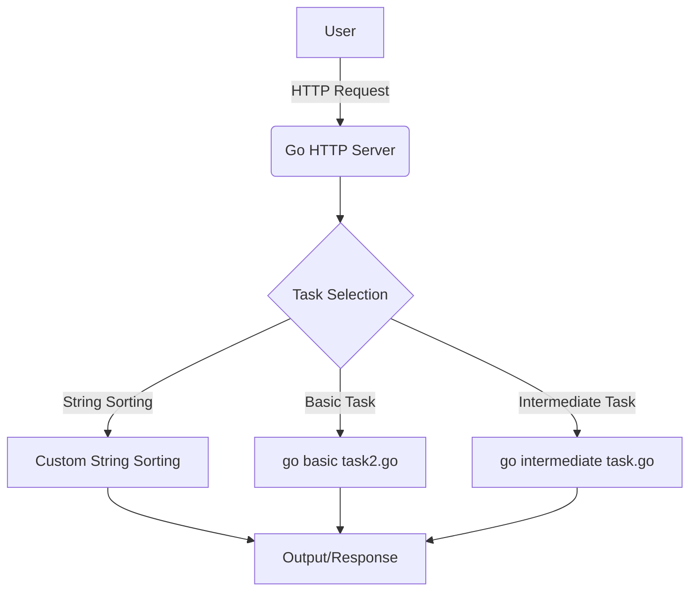

# <span align="center">🚀 **Project Title: Go Basic Tasks**</span>


---

## 📖 **Project Description**

Go Basic Tasks — müxtəlif səviyyəli Go proqramlaşdırma tapşırıqlarının həllini özündə birləşdirən, həm yeni başlayanlar, həm də təcrübəli proqramçılar üçün nəzərdə tutulmuş açıq mənbə layihəsidir. Layihənin əsas məqsədi real nümunələr üzərindən Go dilinin əsas və orta səviyyəli imkanlarını nümayiş etdirmək, praktiki bilikləri artırmaq və kod nümunələri ilə öyrənməni asanlaşdırmaqdır.

---

## 🗂️ **Table of Contents**

- [Features](#features)
- [Installation](#installation)
- [Usage](#usage)
- [Screenshots / Demo](#screenshots--demo)
- [Architecture / Diagram](#architecture--diagram)
- [Technologies Used](#technologies-used)
- [API Reference](#api-reference)
- [Contributing Guidelines](#contributing-guidelines)
- [License](#license)
- [Authors / Maintainers](#authors--maintainers)
- [Acknowledgements](#acknowledgements)
- [FAQ](#faq)
- [Badges / Shields](#badges--shields)
- [Support / Contact](#support--contact)
- [Roadmap](#roadmap)
- [Known Issues](#known-issues)
- [Thank You](#thank-you)

---

## ✨ **Features**

- Sadə və orta səviyyəli Go tapşırıqlarının həlli
- Custom string sorting (istifadəçi qaydasına görə mətn sıralama)
- HTTP server nümunəsi və sorğu emalı
- Modulyar və oxunaqlı kod strukturu
- Asan genişlənə bilən layihə arxitekturası
- Yaxşı sənədləşdirilmiş kod nümunələri

---

## 🛠️ **Installation**

### **Prerequisites**
- Go 1.20 və ya daha yeni versiya
- Git

### **MacOS / Linux**
```bash
git clone https://github.com/ilkinrzayeev/go-basic-tasks.git
cd go-basic-tasks
go mod tidy
go run main.go
```

### **Windows**
```powershell
git clone https://github.com/ilkinrzayeev/go-basic-tasks.git
cd go-basic-tasks
go mod tidy
go run main.go
```

### **Testləri işə salmaq**
```bash
go test ./...
```

### **Linting**
```bash
golint ./...
```

---

## 🚀 **Usage**

Aşağıda əsas istifadə nümunələri göstərilib:

#### **Custom String Sorting**
```go
go run "Custom String Sorting.go"
```

#### **HTTP Server-i işə salmaq**
```go
go run "Go: HTTP Server.go"
```
Server işə düşdükdən sonra brauzerdə `http://localhost:8080` ünvanına daxil olun.

#### **Digər Tapşırıqlar**
```go
go run "go basic task2.go"
go run "go intermediate task.go"
```

---

## 🖼️ **Screenshots / Demo**

> **Custom String Sorting:**
>
> 
>
> **HTTP Server:**
>
> 

---

## 🏗️ **Architecture / Diagram**



**Diaqram izahı:**  
İstifadəçi HTTP sorğusu göndərir və ya proqramı birbaşa işə salır. HTTP server və ya əsas fayl istifadəçinin seçiminə uyğun olaraq müxtəlif tapşırıqları (string sorting, basic, intermediate) icra edir və nəticəni istifadəçiyə qaytarır.

---

## 🧰 **Technologies Used**

- [Go](https://golang.org/) — əsas proqramlaşdırma dili
- [Go Modules](https://blog.golang.org/using-go-modules) — asılılıqların idarə olunması
- [Mermaid](https://mermaid-js.github.io/) — diaqramlar üçün
- [Git](https://git-scm.com/) — versiya nəzarəti

---

## 📚 **API Reference**

> **GET /**  
> Əsas səhifə, layihənin statusunu göstərir.

> **POST /sort**  
> Custom string sorting üçün istifadə olunur.  
> **Request Body:**
> ```json
> { "strings": ["alma", "armud", "banan"] }
> ```
> **Response:**
> ```json
> { "sorted": ["alma", "armud", "banan"] }
> ```

---

## 🤝 **Contributing Guidelines**

- Fork edin və yeni branch yaradın (`feature/your-feature`)
- Kod standartlarına riayət edin (Go fmt, lint)
- Pull request göndərməzdən əvvəl testləri keçirin
- Açıq və aydın commit mesajları yazın
- PR-lar üçün təsvir əlavə edin

---

## 📝 **License**

[](LICENSE)

Bu layihə MIT lisenziyası ilə yayımlanır. İstənilən məqsədlə istifadə, dəyişdirmə və yaymaq sərbəstdir, lakin müəllif hüquqları və lisenziya bildirişi saxlanılmalıdır.

---

## 👤 **Authors / Maintainers**

- **İlkin Rzayev**  
  [GitHub](https://github.com/ilkinrzayeev)  
  [LinkedIn](https://linkedin.com/in/ilkinrzayev)  
  Email: ilkinrzayev@gmail.com

---

## 🙏 **Acknowledgements**

- Go rəsmi sənədləri və tutorial-ları
- Stack Overflow icması
- Açıq mənbə alətləri və kitabxanalar

---

## ❓ **FAQ**

**Sual:** Layihəni necə genişləndirə bilərəm?  
**Cavab:** Yeni tapşırıq əlavə etmək üçün yeni `.go` faylı yaradıb, `main.go`-ya inteqrasiya edin.

**Sual:** Hansı Go versiyası tələb olunur?  
**Cavab:** Go 1.20 və ya daha yeni versiya.

---

## 🏅 **Badges / Shields**


---

## 💬 **Support / Contact**

Əgər sualınız və ya problem varsa, [issue açın](https://github.com/ilkinrzayeev/go-basic-tasks/issues) və ya birbaşa email göndərin: ilkinrzayev@gmail.com

---

## 🛣️ **Roadmap**

- [ ] Yeni tapşırıqların əlavə olunması
- [ ] API endpoint-lərin genişləndirilməsi
- [ ] Web interfeys əlavə olunması
- [ ] Avtomatlaşdırılmış testlərin artırılması

---

## 🐞 **Known Issues**

- Bəzi tapşırıqlarda edge-case-lər tam əhatə olunmaya bilər
- HTTP server yalnız lokal işləyir, prod mühit üçün optimallaşdırılmayıb

---

## 🙌 **Thank You**

Layihəyə maraq göstərdiyiniz üçün təşəkkürlər! Sizin töhfələriniz və rəyiniz layihənin inkişafı üçün çox önəmlidir.

---
